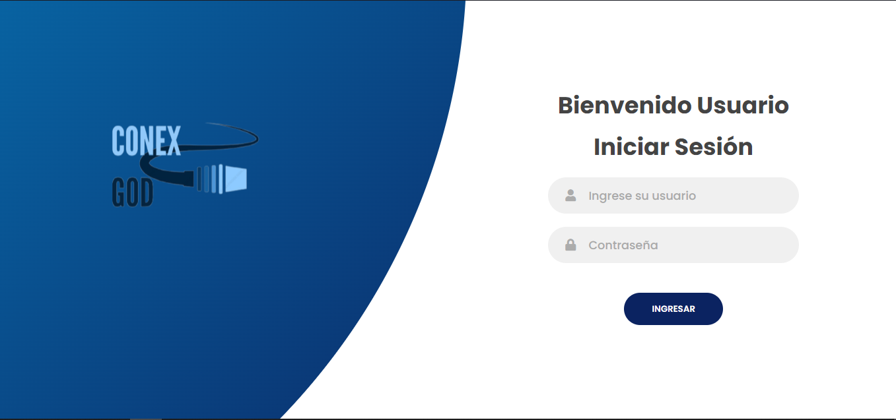
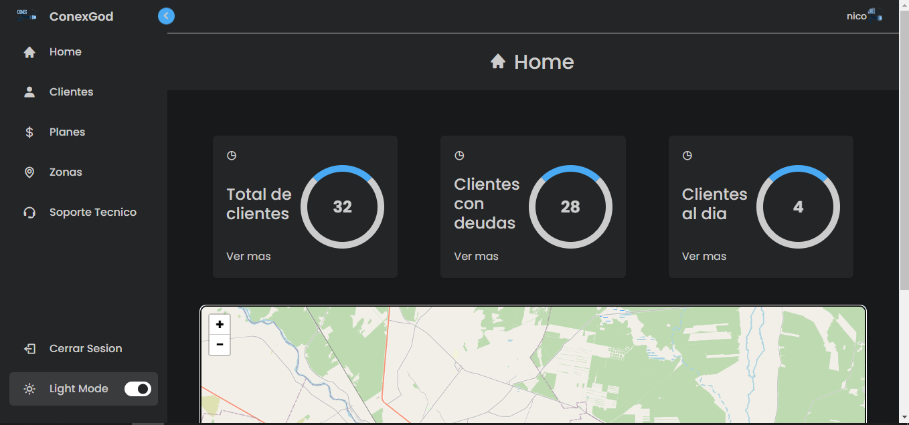
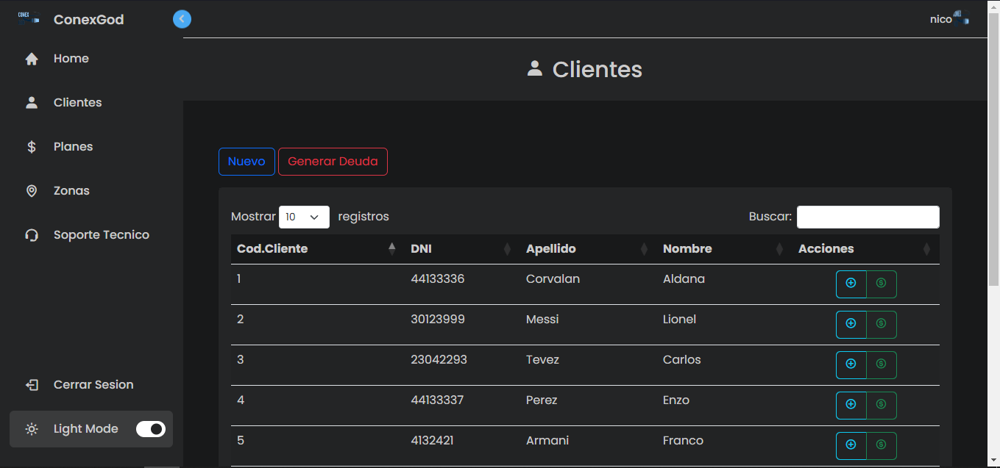
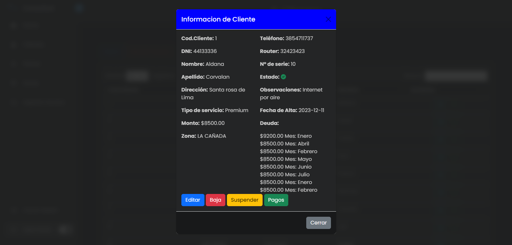

# Gestion_ISP

Este proyecto es el trabajo final para la carrera de Tecnicatura Superior en Programación del Instituto Tecnológico de Santiago del Estero. Se trata de una aplicación web diseñada para gestionar clientes y cobros para una empresa de servicios de internet (ISP).

## Instalación

Para ejecutar la aplicación en un entorno local, primero asegúrate de tener Python instalado en tu sistema. Luego, puedes seguir estos pasos:

1. Clona este repositorio en tu máquina local:

    ```bash
    git clone https://github.com/tu_usuario/gestion_isp.git
    cd gestion_isp
    ```

2. Instala las dependencias del proyecto. Puedes hacerlo utilizando pip y el archivo `requirements.txt`:

    ```bash
    pip install -r requirements.txt
    ```

3. Configura la base de datos:
   
   - La aplicación utiliza MySQL como base de datos. Antes de ejecutar la aplicación, asegúrate de tener MySQL instalado y configurado en tu máquina.
   - Luego, dentro del archivo `gestion_isp/settings.py`, encuentra la sección de configuración de la base de datos y configúrala con el nombre de la base de datos que ya creaste previamente, así como con tu contraseña.

4. Ejecuta las migraciones de Django para crear las tablas en la base de datos:

    ```bash
    python manage.py migrate
    ```

5. Inicia el servidor local:

    ```bash
    python manage.py runserver
    ```

6. Abre tu navegador web y accede a `http://127.0.0.1:8000/` para ver la aplicación en funcionamiento.

## Imágenes de la app

Aquí están algunas imágenes de la aplicación en funcionamiento:





---
